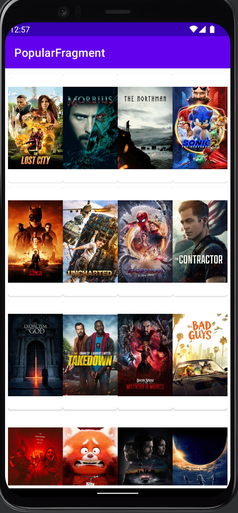

# Movies
Moviesis a mobile android application that displays the list of movies from the [Movies API](https://developers.themoviedb.org/3/movies) using clean architecture and MVVM .Built  entirely using kotlin among other [Android Architecture Compoonents](https://developer.android.com/topic/architecture)
 
 ## Tech Stack
 
   * [Hilt](https://dagger.dev/hilt//) - Dependency Injection library 
   * [ViewBinding](https://developer.android.com/topic/libraries/view-binding) a feature that allows you to more easily write code that interacts with views. Once view binding is enabled in a module, it generates a binding class for each XML layout file present in that module.
   * [Glide](https://github.com/bumptech/glide)Glide is an Image Loader Library for Android developed by bumptech and is a library that is recommended by Google.
   * [Data Binding](https://developer.android.com/topic/libraries/data-binding) - Data Binding library 
   *[ViewModel](https://developer.android.com/topic/libraries/architecture/viewmodel) - Designed to store and manage UI-related data in a lifecycle conscious way. The ViewModel class allows data to survive configuration changes such as screen rotations.
   * [Coroutines](https://github.com/Kotlin/kotlinx.coroutines) - Library Support for coroutines.
   * [Navigation Component](https://developer.android.com/guide/navigation/navigation-getting-started)-Component that allows easier implementation of navigation from simple button clicks to more complex patterns.
   * [Android KTX](https://developer.android.com/kotlin/ktx.html) - Provide concise, idiomatic Kotlin to Jetpack and Android platform APIs.
   * [AndroidX](https://developer.android.com/jetpack/androidx) - Major improvement to the original Android [Support Library](https://developer.android.com/topic/libraries/support-library/index), which is no longer maintained.
   * [Lifecycle](https://developer.android.com/topic/libraries/architecture/lifecycle) - Perform actions in response to a change in the lifecycle status of another component, such as activities and fragments.
      
     

* Patterns
    * [Clean Architecture ](https://blog.cleancoder.com/uncle-bob/2012/08/13/the-clean-architecture.html)-
Clean architecture is a software design philosophy that separates the elements of a design into ring levels. An important goal of clean architecture is to provide developers with a way to organize code in such a way that it encapsulates the business logic but keeps it separate from the delivery mechanism.
    * [MVVM]

* CI/CD
    * [Github Actions](https://github.com/actions)
    
 * App Views

 

